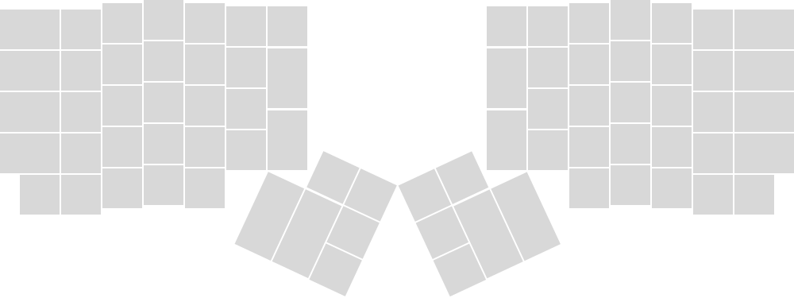

# ErgoDox Layout Maker
Web based open source ErgoDox Layout Maker.

## Dependencies

- d3 for SVG stuff
- jQuery for everything else.
- nodejs / npm

## Quick Start

    npm install gulp -g
    npm install
    npm start

## References

- [How to create a keymap](https://github.com/benblazak/ergodox-firmware#create-a-new-keymap)
- [ErgoDox Keyboard Firmware](https://github.com/benblazak/ergodox-firmware)
- [TMK](https://github.com/tenderlove/tmk_keyboard/tree/master/keyboard/ergodox)
- [Unicode: Keyboard Symbols](http://xahlee.info/comp/unicode_computing_symbols.html)

### Compiling firmware (on OSX)

Prerequisites (see https://github.com/osx-cross/homebrew-avr/):

    brew tap osx-cross/avr
    brew install avr-libc

After this it is a simple `make` inside the `src` folder of the [firmware](https://github.com/benblazak/ergodox-firmware).

To compile a different layout: `make LAYOUT=layout`, so say `make LAYOUT=dvorak-kinesis-mod`

## Ideas

- Make standalone using http://electron.atom.io/
- Integrate directly with Teensy loader (http://www.pjrc.com/teensy/loader_cli.html)
- Check whether we're on Mac, Linux or Windows to detect which the best representation of the key is.